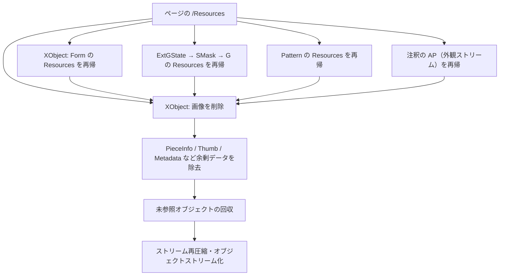

# pdf-shrink-split
Shrink and split large PDFs effortlessly. Removes images to reduce file size and splits by character count limit. No manual installation required for dependencies.  
巨大なPDFを簡単に軽量化＆分割。画像を削除してファイルサイズを削減し、字数制限に合わせて自動で分割します。ライブラリのインストールも自動で行われます。

# PDF Image Remover & Splitter 🔖✂️

[](https://www.python.org/)

PDFファイルから画像を完全削除しつつテキスト構造を保持するPythonツール。字数制限を超える場合は自動で複数ファイルに分割します。

## 🚀 特徴
- **画像完全削除** - 入れ子になったリソースまで再帰的に探索し、画像オブジェクトを実際に削除
- **余剰データの除去** - Photoshop/Illustratorが残す `/PieceInfo`、サムネイル、メタデータを削除
- **自動分割** - 10万字を超えるPDFを複数ファイルに分割
- **依存パッケージ自動インストール** - 初回実行時にPyPDF2・pikepdfを自動導入
- **スマート圧縮** - pikepdfによるストリーム再圧縮とオブジェクトストリーム化
- **シンプル操作** - 入力ファイルを指定するだけ
- **安全弁** - テキストを抽出できないPDF（スキャン画像のみ）は処理を中止

実測では **27.11MB → 1.28MB（95.3%削減）**、**10.54MB → 0.13MB（98.8%削減）** を達成しており、
テキストの抽出字数は入力と完全に一致します。

## ⚙️ 動作環境
- Python 3.8+
- 依存パッケージは**自動インストール**されます（手動インストール不要）

## 使用方法

### 基本コマンド
```bash
python pdf-shrink-split.py 入力ファイル.pdf
```
出力: `入力ファイル_no_images.pdf`（字数制限内の場合）

### 字数制限を超える場合
自動的に分割されます：
```
入力ファイル_part1.pdf
入力ファイル_part2.pdf
入力ファイル_part3.pdf
...
```

### 字数制限オプション
デフォルトは10万字（100,000文字）。変更するには `--char-limit` を使用：
```bash
python pdf-shrink-split.py 入力.pdf --char-limit 50000
```

### テキストを持たないPDFの扱い
スキャンした画像だけのPDFは、画像を削除すると内容そのものが失われます。
そのため1字もテキストを抽出できない場合は、処理を中止して終了コード1を返します：

```
$ python pdf-shrink-split.py scanned.pdf
--- 字数カウント情報 ---
ページ数: 91
総字数:   0
字数制限: 100,000
------------------------
❌ このPDFからはテキストを抽出できません（91ページすべて0字）。スキャンした画像のみのPDFの
可能性が高く、画像を削除すると内容が失われます。

このPDFはこのツールの対象外です。元のファイルをそのままお使いください。
それでも画像を削除したい場合は --force を付けて実行してください。
```

意図的に処理したい場合は `--force` を指定します。また、半分以上のページから
テキストを抽出できなかった場合は、処理は続行しつつ警告を表示します。

## 実行例
```
$ python pdf-shrink-split.py document.pdf
--- 字数カウント情報 ---
ページ数: 47
総字数:   144,714
字数制限: 100,000
------------------------
📄 2個のファイルに分割します。
  [1/2] document_part1.pdf  (28ページ, 98,110字, 0.80MB)
  [2/2] document_part2.pdf  (19ページ, 46,604字, 0.49MB)

削除した画像: 237個
サイズ: 27.11MB → 1.28MB (95.3% 削減)

✅ 完了しました！
```

## 🌐 Webアプリ版（Streamlit）
ブラウザから使える版も同梱しています。ファイルをドラッグ＆ドロップし、生成されたPDFを
個別またはZIPで一括ダウンロードできます。

```bash
pip install -r requirements.txt
streamlit run streamlit_app.py
```

## 🧪 開発・テスト
```bash
pip install -r requirements-dev.txt
pytest tests -v
```

テストに使うPDFはリポジトリにバイナリを置かず、`tests/pdf_fixtures.py` が実行時に生成します。
画像をForm XObjectの入れ子・ソフトマスクグループ・パターン・注釈の外観の中に埋め込んだ検体を作り、
それらが削除されることを確認します。

GitHub Actions（`.github/workflows/ci.yml`）では、push と pull request ごとに
Python 3.11 / 3.14 でテストと `requirements.txt` のピン留めチェックを実行します。

> **デプロイについて**: Streamlit Community Cloud はリポジトリを監視して
> push ごとに自動で再デプロイします（SCCに外部からデプロイを叩くAPIはありません）。
> そのため CI はデプロイを行わず、品質ゲートとしてのみ動作します。
> `requirements.txt` を固定しているのは、SCCが再ビルドのたびに最新版を取得して
> デプロイ版の挙動が勝手に変わるのを防ぐためです。

## 技術的詳細
### 画像削除のメカニズム
画像はページ直下の `/Resources/XObject` だけでなく、Form XObjectの入れ子や
ソフトマスクグループの中にも置かれています。これらを再帰的に辿らないと
画像が削除されずファイルに残り続けます。



探索時は各オブジェクトのID（objgen）で訪問済みを管理し、循環参照や
共有リソースの二重処理を防いでいます。

### 削除されるもの / 保持されるもの
| | 対象 |
|---|---|
| 削除 | 画像XObject（入れ子・ソフトマスク・パターン・注釈の外観内を含む）、`/PieceInfo`、`/Thumb`、`/Metadata`、`/StructTreeRoot` |
| 保持 | テキスト、埋め込みフォント、ベクター図形、注釈、しおり（`/Outlines`）、`/Names` |

## 想定ユースケース
 - ✅ 機械翻訳システムへのアップロード前処理
 - ✅ 字数制限のあるサービスへの分割アップロード
 - ❌ 印刷用原稿データ（DTP処理が必要なケース）
 - ❌ 暗号化されたPDF
 - ❌ スキャン画像のみのPDF（テキストを持たないため、画像削除で内容が失われます）

## ⚠️ 注意事項
- 暗号化されたPDFには対応していません
- レイアウト崩れが発生する可能性があります（特に複雑なテーブルを含むPDF）
- スキャンしたPDFなどテキストを持たないファイルは処理が中止されます（`--force` で続行可能ですが、中身が空になります）
- 重要なファイルは必ずバックアップを取ってから実行してください

## ❓ FAQ
Q: 画像以外の要素は削除されますか？  
A: テキスト、ベクター図形、注釈、しおりなどは保持されます

Q: 分割はどのように行われますか？  
A: 先頭ページから順に字数を累計し、10万字（デフォルト）を超えるタイミングで次のファイルに分けます

Q: 「このPDFからはテキストを抽出できません」と出て処理されません  
A: 文字が画像として入っているPDF（スキャンなど）です。画像を削除すると中身が
失われるため、安全弁として中止しています。元のファイルをそのままお使いください

Q: 画像を削除してもあまり小さくなりません  
A: 残りの容量が埋め込みフォントで占められている可能性があります。本ツールはフォントの
サブセット化を行わないため、テキスト主体のPDFでは削減幅が小さくなります

Q: 分割すると合計サイズが単一出力より大きくなるのはなぜ？  
A: 各パートがそれぞれ埋め込みフォントを持つため、分割数に応じてフォント分が重複します

Q: 元のPDFに戻せますか？  
A: 本ツールは非破壊処理ではありません。必ず元ファイルを保持してください
