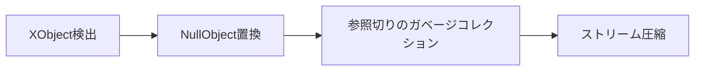

# pdf-shrink-split
Shrink and split large PDFs effortlessly. Removes images to reduce file size and splits by character count limit. No manual installation required for dependencies.  
巨大なPDFを簡単に軽量化＆分割。画像を削除してファイルサイズを削減し、字数制限に合わせて自動で分割します。ライブラリのインストールも自動で行われます。

# PDF Image Remover & Splitter 🔖✂️

[](https://www.python.org/)

PDFファイルから画像を完全削除しつつテキスト構造を保持するPythonツール。字数制限を超える場合は自動で複数ファイルに分割します。

## 🚀 特徴
- **画像完全削除** - XObjectを検出しNullObjectで置換
- **自動分割** - 10万字を超えるPDFを複数ファイルに分割
- **依存パッケージ自動インストール** - 初回実行時にPyPDF2・pikepdfを自動導入
- **スマート圧縮** - pikepdfによるストリーム最適化
- **シンプル操作** - 入力ファイルを指定するだけ

## ⚙️ 動作環境
- Python 3.8+
- 依存パッケージは**自動インストール**されます（手動インストール不要）

## 使用方法

### 基本コマンド
```bash
python pdf_image_remover.py 入力ファイル.pdf
```
出力: `入力ファイル_no_images.pdf`（字数制限内の場合）

### 字数制限を超える場合
自動的に分割されます：
```
入力ファイル_part1.pdf
入力ファイル_part2.pdf
入力ファイル_part3.pdf
...
```

### 字数制限オプション
デフォルトは10万字（100,000文字）。変更するには `--char-limit` を使用：
```bash
python pdf_image_remover.py 入力.pdf --char-limit 50000
```

## 実行例
```
$ python pdf_image_remover.py document.pdf
--- 字数カウント情報 ---
ページ数: 255
総字数:   274,521
字数制限: 100,000
------------------------
📄 3個のファイルに分割します。
  [1/3] document_part1.pdf  (57ページ, 98,706字)
  [2/3] document_part2.pdf  (72ページ, 97,432字)
  [3/3] document_part3.pdf  (126ページ, 78,383字)

✅ 完了しました！
```

## 技術的詳細
### 画像削除のメカニズム


## 想定ユースケース
 - ✅ 機械翻訳システムへのアップロード前処理
 - ✅ 字数制限のあるサービスへの分割アップロード
 - ❌ 印刷用原稿データ（DTP処理が必要なケース）
 - ❌ 暗号化されたPDF

## ⚠️ 注意事項
- 暗号化されたPDFには対応していません
- レイアウト崩れが発生する可能性があります（特に複雑なテーブルを含むPDF）
- 重要なファイルは必ずバックアップを取ってから実行してください

## ❓ FAQ
Q: 画像以外の要素は削除されますか？
A: テキスト、ベクター図形、注釈などは保持されます

Q: 分割はどのように行われますか？
A: 先頭ページから順に字数を累計し、10万字（デフォルト）を超えるタイミングで次のファイルに分けます

Q: 元のPDFに戻せますか？
A: 本ツールは非破壊処理ではありません。必ず元ファイルを保持してください
